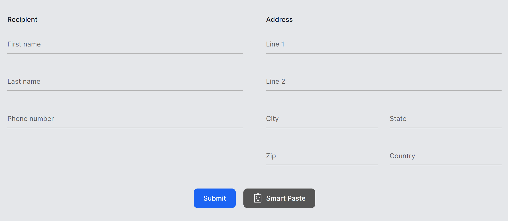
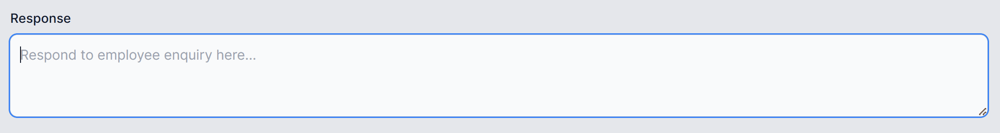

# Smart Components

Smart Components lets you **add genuinely useful AI-powered features to your .NET apps quickly, easily, and without risking wasted effort.** 

You don't have to spend weeks of dev time redesigning your UX or researching machine learning and prompt engineering. Smart Components are prebuilt end-to-end AI features that you can drop into your existing UIs to upgrade them, truly making your app more productive for your end users.

This is an experiment from the .NET team, and is initially available for **ASP.NET Core 6.0 and later** with either:

 * **Blazor** (see: [Getting started with Smart Controls and Blazor](docs/getting-started-blazor.md))
 * **MVC / Razor Pages** (see: [Getting started with Smart Controls and MVC/Razor Pages](docs/getting-started-mvc-razor-pages.md))

We may add support for other UI tech (e.g., native apps) later, depending on feedback.

## What's included

The set of components and features may expand over time. Currently, Smart Components includes:

### Smart Paste

A button that fills out forms automatically using data from the user's clipboard. You can use this with any existing form in your web app. This helps users add data from external sources without re-typing.



Learn more: [Smart Paste docs](docs/smart-paste.md)

### Smart TextArea

An intelligent upgrade to the traditional textarea. You can configure how it should autocomplete whole sentences using your own preferred tone, policies, URLs, and so on. This helps users type faster and not have to remember URLs etc.



Learn more: [Smart TextArea docs](docs/smart-textarea.md)

### Smart ComboBox

Upgrades the traditional combobox by making suggestions based on semantic matching. This helps users find what they're looking for.


Learn more: [Smart ComboBox docs](docs/smart-combobox.md)

### Local Embeddings

Computes the level of semantic similarity between two natural language strings, or finds the closest match from a set of candidates. **This runs entirely locally on your server's CPU**, so doesn't need any external AI service.

Example: evaluating the semantic similarity between two strings

```cs
var article1 = embedder.Embed("Vacation allowance policy");
var article2 = embedder.Embed("Returning a company vehicle");
var article3 = embedder.Embed("How to get your boss fired");

var searchTerm = embedder.Embed("car");
Console.WriteLine(searchTerm.Similarity(article1)); // Outputs: 0.41
Console.WriteLine(searchTerm.Similarity(article2)); // Outputs: 0.70
Console.WriteLine(searchTerm.Similarity(article3)); // Outputs: 0.38
```

Example: finding closest matches

```cs
// Find closest matches to "ball game"
var candidates = embedder.EmbedRange(["Soccer", "Tennis", "Swimming", "Horse riding", "Golf", "Gymnastics"]);

var closest = LocalEmbedder.FindClosest(
    embedder.Embed("ball game"), candidates, maxResults: 3);

Console.WriteLine(string.Join(", ", closest)); // "Soccer, Golf, Tennis"
```

Unlike the others, this isn't a prebuilt end-to-end UI feature; it's a general capability you can use to power your own features, such as search or [retrieval-augmented generation (RAG)](https://en.wikipedia.org/wiki/Prompt_engineering#Retrieval-augmented_generation).

Learn more: [Local Embeddings docs](docs/local-embeddings.md)

## Running the samples

1. If you don't already have it, install a current [.NET SDK for Windows, Linux, or Mac](https://dotnet.microsoft.com/download).

1. Clone this repo

   ```
   git clone https://github.com/dotnet-smartcomponents/smartcomponents.git
   cd smartcomponents
   ```

1. If you want to run the Smart Paste or Smart TextArea samples, edit the `RepoSharedConfig.json` file at the root of the solution to add your API key. See [How to configure an OpenAI backend](docs/configure-openai-backend.md).

   You can skip this if you only want to run the Smart ComboBox or Local Embeddings samples, since they run entirely locally.

1. Run it

   ```
   cd samples/ExampleBlazorApp
   dotnet run
   ```

Once you're ready to add Smart Components to your own app, see:

 * [Getting started with Smart Controls and Blazor](docs/getting-started-blazor.md)
 * [Getting started with Smart Controls and MVC/Razor Pages](docs/getting-started-mvc-razor-pages.md)

## Feedback and support

The purpose of this experiment is to assess whether/how the .NET community would want to use prebuilt UI components for AI features.

**Please take a moment to share your thoughts and feedback with us by filling out our short [.NET Smart Components survey](https://aka.ms/smartcomponents/survey).**

You can also report issues and suggest improvements by [creating an issue](https://github.com/dotnet-smartcomponents/smartcomponents/issues) on GitHub.

Smart Components isn't yet an officially supported part of .NET. Whether or not it graduates to full support depends on community feedback and usage levels.

## Contributing

This project has adopted the [Microsoft Open Source Code of Conduct](https://opensource.microsoft.com/codeofconduct/). For more information see the [Code of Conduct FAQ](https://opensource.microsoft.com/codeofconduct/faq/) or contact [opencode@microsoft.com](mailto:opencode@microsoft.com) with any additional questions or comments.
