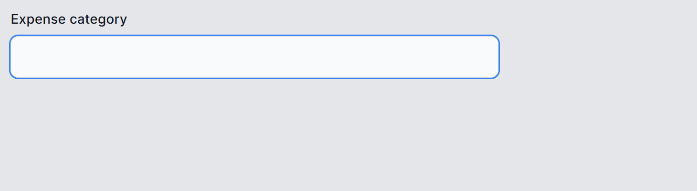

# Smart ComboBox

A *combo box* is a UI input element that allows users to type a value *and* to select a predefined value from an autocompleting dropdown.

Traditional combo boxes suggest values only based on exact substring matches. Smart ComboBox upgrades this by suggesting semantic matches (i.e., options with the most closely related meanings). This is much more helpful for users who don't know/remember the exact predefined string they are looking for.



### Example use cases

 * **Accounting category**

   In an expense tracking app, a user may wish to submit a claim for a plane ticket. In the "Category" field, the user starts typing "**plane tic**", then notices that the Smart ComboBox is offering the suggestion "**Transport: Airfare**", since that's the correct accounting category name in this system.

   Without semantic matching, it would have been difficult for the user to look through potentially hundreds of accounting category names to find the correct one for a plane ticket.

 * **Tags and labels**

   A bug tracking system might allow users to attach labels/tags to issues, selecting either an existing label or creating a new label. In the "Label" field, a user types "**slow**", then notices that the Smart ComboBox is offering the suggestions "**Performance**" and "**Usability**", since those labels already exist.
   
   This fixes a common problem of people creating multiple labels for the same concept because they don't realize a suitable label already exists.

## Adding Smart ComboBox in Blazor

First, make sure you've followed the [Smart Component installation steps for Blazor](getting-started-blazor.md). For Smart ComboBox, you do *not* need to configure the OpenAI backend, since it runs entirely locally.

Then, in a `.razor` file (and usually inside a `<form>` or `<EditForm>`), add the `<SmartComboBox>` component. Example:

```razor
<SmartComboBox Url="api/accounting-categories" @bind-Value="@text" />

@code {
    string? text; // Optionally, set a default value here
}
```

The `Url` and `@bind-Value` attributes are both required. You **must** also set up an API endpoint matching this `Url` - see below for steps.

`SmartComboBox` integrates with Blazor's binding, forms, and validation features in exactly the same way as an `InputText`.

## Adding Smart ComboBox in MVC/Razor Pages

First, make sure you've followed the [Smart Component installation steps for MVC/Razor Pages](getting-started-mvc-razor-pages.md). For Smart ComboBox, you do *not* need to configure the OpenAI backend, since it runs entirely locally.

Then, in a `.cshtml` file (and usually inside a `<form>`), add the `<smart-combobox>` tag. Example:

```cshtml
<smart-combobox url="~/api/accounting-categories" />
```

The `url` attribute is required. You **must** also set up an API endpoint matching this `url` - see below for steps.

## Setting up the API endpoint

Whether you're using Blazor or MVC/Razor Pages, you also need to set up an API endpoint that Smart ComboBox will call to get suggestions.

To do this, go to your server's `Program.cs`, and add the following alongside other calls to `app.Map*` APIs:

```cs
var candidates = new[] { "Transport", "Rent", "Payroll", "Party" };

app.MapSmartComboBox("api/accounting-categories",
    request => candidates);
```

If you run this now, you'll see the Smart ComboBox is not yet very smart, since it will always use those 4 fixed suggestions, regardless of what the user types.

### Adding semantic matching

Semantic matching is achieved using *embeddings*, a way of converting natural-language strings into numerical vectors. The more conceptually related are two strings, the closer their vectors. You can use external AI services to compute embeddings, but you can also compute them quite cheaply and easily on your server (no need for a GPU - the CPU will work fine).

#### Reference and register the embedder service

In your **server** project, add a reference to the package `SmartComponents.LocalEmbeddings`:

 * Command line: `dotnet add package --prerelease SmartComponents.LocalEmbeddings`
 * Visual Studio: Right-click your project name, choose *Manage NuGet packages...*, and then search for and install `SmartComponents.LocalEmbeddings`.
   * Note: Check the *Include prerelease* option if needed.

Next, in `Program.cs` under the comment `// Add services to the container`, register it:

```cs
builder.Services.AddSingleton<LocalEmbedder>();
```

#### Perform semantic matching

Replace your existing call to `app.MapSmartComboBox` with the following:

```cs
// Compute the embeddings once up front
var embedder = app.Services.GetRequiredService<LocalEmbedder>();
var categories = embedder.EmbedRange(new[] { "Groceries", "Utilities", "Rent", "Mortgage", "Car Payment", "Car Insurance", "Health Insurance", "Life Insurance", "Home Insurance", "Gas", "Public Transportation", "Dining Out", "Entertainment", "Travel", "Clothing", "Electronics", "Home Improvement", "Gifts", "Charity", "Education", "Childcare", "Pet Care", "Other" });

app.MapSmartComboBox("api/accounting-categories",
    request => embedder.FindClosest(request.Query, categories));
```

If you run the application, you'll see it now *does* suggest semantic matches. For example, if you type "**cat**" it will suggest "**Pet Care**", whereas if you type "**plane**" it will suggest "**Travel**".

In most cases you won't want to have a fixed, hardcoded list of candidate suggestions like the code above does. You will likely want to store embeddings in your existing data store (e.g., as a field called `Embedding` on some entity type in a relational DB). To learn more about computing, storing, and querying embeddings, see [Local Embeddings](local-embeddings.md).

Note that the `request` parameter supplied to your `MapSmartComboBox` also contains an `HttpContext` property. You can use that to access other DI services, perform access control, or return user-specific results.

### Implementing the API endpoint manually

If you don't want to use `MapSmartComboBox`, you can implement an API endpoint manually in any way you like as long as:

 * It responds to POST requests at the URL you specified with `Url` or `url`
 * It accepts the parameters `inputValue`, `maxResults`, and `similarityThreshold` in the POST body (`application/x-www-form-urlencoded`)
 * It responds with a JSON-formatted array of strings

## Styling the combobox

Smart ComboBox renders as an HTML `<input>` element. You can style it by adding any CSS class names or other HTML attributes that apply to `<input>`.

The suggestions dropdown is rendered as an HTML custom element with tag name `smart-combobox`, which starts hidden but becomes visible when suggestions are to be shown.

So at runtime, rendered HTML structure looks as follows (plus many other attributes, including `role` and `aria-*` ones, omitted for clarity):

```html
<input value="Some value">
<smart-combobox class="smartcombobox-suggestions">
    <div class="smartcombobox-suggestion">Suggestion 1/div>
    <div class="smartcombobox-suggestion selected">Suggestion 2 (selected)</div>
    <div class="smartcombobox-suggestion">Suggestion 3</div>
</smart-combobox>
```

You can target these CSS class names from your own `.css` files in order to customize the appearance.

### Using scoped CSS

If you are using scoped CSS (i.e., a `.razor.css` or `.cshtml.css` file), remember to use the `::deep` pseudoselector to match these class names, since they are being rendered in a child context. For example:

```css
::deep .smartcombobox-suggestions { /* ... */ }
```

## Customizing the suggestions

Smart ComboBox also accepts the following parameters:

 * **Maximum number of suggestions** (default: 10)
   * Blazor: `<SmartComboBox MaxSuggestions="3" ... />`
   * MVC/Razor Pages: `<smart-combobox max-suggestions="3" ... />`
 * **Similarity threshold** (default: 0.5, range: 0 - 1). Matches with a lower similarity won't be shown. If you set this too high, you won't get any matches unless the text is an exact match.
   * Blazor: `<SmartComboBox SimilarityThreshold="0.6f" ... />`
   * MVC/Razor Pages: `<smart-combobox similarity-threshold="0.6f" ... />`

Note that these parameters are simply instructions to the API endpoint. By default, `MapSmartComboBox` does honor these instructions, but if you implement an API endpoint manually, your code is free to honor or ignore them.
